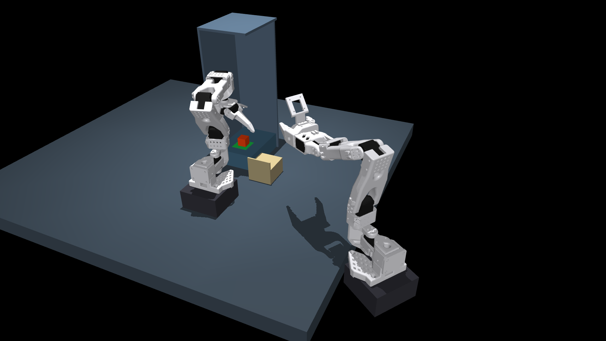

# Rendered checks

The new [task-screening gallery](task_screening/README.md) contains the candidate
enclosures, searched-fixed comparisons, scripted camera-motion videos, retained
failures and pre-training results. These prototypes are separate from the complete
original-task rollouts below.

The arms are white. The fixed outside camera records both arms and the work area
at **1920×1080, 25 fps**. These videos use MjLab/Warp physics with an OpenGL observer
render of the actual simulation state.

| Task | Full-HD outside-view video | Full-resolution still |
|---|---|---|
| Plug insertion | [Watch](warp_sanity/plug_warp_phase_overview.mp4) | [View](warp_sanity/plug_warp_phase_overview.png) |
| Transfer | [Watch](warp_sanity/transfer_warp_phase_overview.mp4) | [View](warp_sanity/transfer_warp_phase_overview.png) |
| Pushing | [Watch](warp_sanity/push_warp_phase_overview.mp4) | [View](warp_sanity/push_warp_phase_overview.png) |

[Video format and success checks](overview_validation.json) cover all nine outside-view recordings.

No models were trained. Scripted success establishes mechanical feasibility, not a camera-policy advantage.

| Task | Native clean | Native phase occlusion | MjLab/Warp CPU phase occlusion |
|---|---|---|---|
| plug | [pass](sanity/plug_clean.mp4) · [frames](sanity/plug_clean.png) · [metrics](sanity/plug_clean.json) | [pass](sanity/plug_phase.mp4) · [frames](sanity/plug_phase.png) · [metrics](sanity/plug_phase.json) | [pass](warp_sanity/plug_warp_phase.mp4) · [frames](warp_sanity/plug_warp_phase.png) · [metrics](warp_sanity/plug_warp_phase.json) |
| transfer | [pass](sanity/transfer_clean.mp4) · [frames](sanity/transfer_clean.png) · [metrics](sanity/transfer_clean.json) | [pass](sanity/transfer_phase.mp4) · [frames](sanity/transfer_phase.png) · [metrics](sanity/transfer_phase.json) | [pass](warp_sanity/transfer_warp_phase.mp4) · [frames](warp_sanity/transfer_warp_phase.png) · [metrics](warp_sanity/transfer_warp_phase.json) |
| push | [pass](sanity/push_clean.mp4) · [frames](sanity/push_clean.png) · [metrics](sanity/push_clean.json) | [pass](sanity/push_phase.mp4) · [frames](sanity/push_phase.png) · [metrics](sanity/push_phase.json) | [pass](warp_sanity/push_warp_phase.mp4) · [frames](warp_sanity/push_warp_phase.png) · [metrics](warp_sanity/push_warp_phase.json) |

Native videos show wrist / reference fixed / moving camera views. Warp videos show the actual wrist and camera-arm RGB tensors supplied to the actor. The policy-camera images below are rendered at 96×72 and enlarged for viewing;
the outside videos above are rendered directly at 1920×1080.

The reference fixed camera in these mosaics is **not** the best searched viewpoint. The [overhead Warp snapshot](static_overhead_warp.png) separately verifies a searched-grid camera pose. No fixed view has yet been selected by policy validation.

The native plug audit reports zero pin pixels from the wrist throughout the nominal rollout; the external pin is only a few pixels at this resolution. Run matched higher-resolution sensitivity experiments before attributing failures solely to information availability.

[Tests](tests.log), [CPU-only benchmark](benchmark_cpu.json), [randomized scripted checks](randomized_script_checks.json), and [the earlier bare-jaw Warp pushing failure](debug/push_bare_jaw_warp_failure.json) are retained. The current pushing videos use the documented rigid tip. CUDA execution and trained-policy results remain unmeasured.
