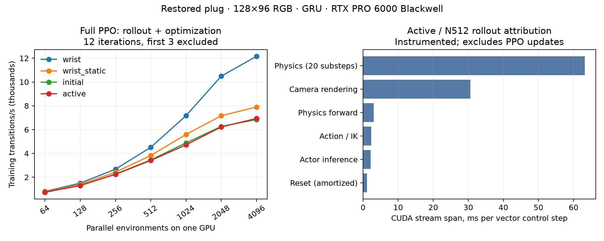

# Throughput follow-up — 2026-10-07

Only disposable measurements were added. The four completed N512 scientific pilots,
checkpoints, transition budgets and W&B identities remain unchanged. No larger study
or distributed-policy training was launched. All measurements use one RTX PRO 6000
Blackwell Server Edition (97,887 MiB), 8 CPUs and 48 GiB host RAM per process.

## Measured full-training throughput

128×96 RGB, GRU, restored hidden-prong plug, clean occlusion, fixed view 7 for
wrist_static, seed 0, 24 rollout steps, 4 PPO epochs / 8 minibatches. Twelve PPO
iterations per disposable cell, first three excluded. Physics, reward, camera
geometry, control rate and one-second pause are unchanged. One vector control step
produces N environment transitions; each control step uses twenty physics substeps.

| Condition | N512 | N1024 | N2048 | N4096 | N2048 / N512 |
|---|---:|---:|---:|---:|---:|
| wrist | 4,512 | 7,170 | 10,491 | 12,162 | 2.33× |
| wrist_static | 3,827 | 5,591 | 7,169 | 7,902 | 1.87× |
| initial | 3,456 | 4,884 | 6,266 | 6,845 | 1.81× |
| active | 3,408 | 4,720 | 6,223 | 6,941 | 1.83× |

Rates above are **environment transitions/s including rollout and PPO updates**.
N2048 peaks at 29.9–39.4 GiB; N4096 at 58.6–77.7 GiB. Doubling N2048 to N4096
adds only 9–16% throughput while almost doubling memory. New cells have iteration
CVs of 3.3–9.8%; these are short, single-run measurements, not statistical confidence
intervals. Other jobs share nodes. N512 references are the original completed sweep.
Initialization takes 25.7–88.0s and three-iteration warmup 28.2–77.4s in new PPO
cells; initialization includes Warp compilation and warmup includes policy/IK setup.
Aggregate steady timing covers 6,193,152 transitions, versus 8,257,536 total new
disposable training transitions. PPO application cost including W&B finish: 0.573 GPU-h.

[Full timing/memory/budget table](BENCHMARKS.md) · [CSV](benchmark_comparison.csv) ·
[Machine-readable follow-up](throughput_followup.json) · [Plot PDF](throughput_scaling.pdf)

## Simulation, cameras and training are different measurements

At N4096, 100 measured control steps / 409,600 transitions after 25 warmup steps:

| Workload | Transitions/s | Measured seconds | W&B |
|---|---:|---:|---|
| simulation_only | 32,169 | 12.733 | [run](https://wandb.ai/pgozdil-harvard-university/active-perception-so101/runs/jzws98yx) |
| simulation_and_rendering_only | 12,325 | 33.232 | [run](https://wandb.ai/pgozdil-harvard-university/active-perception-so101/runs/tqvonryi) |
| simulation_and_actor_inference_only | 10,464 | 39.143 | [run](https://wandb.ai/pgozdil-harvard-university/active-perception-so101/runs/yu2bqx20) |
| Full active PPO | 6,941 | 127.468 (9 iterations / 884,736 transitions) | [run](https://wandb.ai/pgozdil-harvard-university/active-perception-so101/runs/np51ttob) |

The first two use the same zero-action controller. Actor inference uses an untrained
actor and PPO uses sampled learning rollouts, so differences are not exact additive
component costs. Simulation-only excludes rendered policy inputs and learning.

The separate N512 active profile measures 4,874.8 actor/env transitions/s before
instrumentation. Instrumented CUDA stream spans per vector step: physics 63.18ms,
camera rendering 30.63ms, forward 3.04ms, action/IK 2.33ms, actor 2.18ms, reset
1.11ms amortized. Physics and rendering dominate. These spans include scheduling
gaps; they are not pure kernel execution time. Reset IK is nested in reset and
must not be added again. Windows differ in trajectories. GPU utilization averages
in JSON include compilation/startup; they are not steady-state utilization estimates.

[Profile JSON](profile-active-512.json) · [Profile W&B](https://wandb.ai/pgozdil-harvard-university/active-perception-so101/runs/4hij4szn)

## Historical comparison and multi-GPU

Current policies each use one GPU. Multiple policies run independently in parallel;
there is no distributed PPO launcher configured. Legacy checkout b6cd299 has an
older pl3 launch requesting four GPUs × 1,024 environments/GPU at 96px. Its retained
36864038_0 log failed with SIGBUS, so it does not verify historical throughput.
Legacy benchmark_steps.py sweeps up to 8,192 environments, and its insertion config
uses timestep 0.0044 × five substeps (≈45.45 Hz), versus restored 0.002 × twenty
(25 Hz). The user’s historical 20–30k rate has not been tied to a verified exact
run/workload. The new simulation-only measurement already exceeds 30k on one GPU.

## Optimization recommendation and learning limits

1. N2048 is a practical performance candidate: all four conditions fit and finish,
   with 1.8–2.3× speedup. Preserve N512 for existing experiment resumes. Test learning
   efficiency before adopting a different batch for new matched scientific runs.
2. Profile physics collision/solver kernels and renderer kernels next. The existing
   simulator already uses CUDA graphs per physics step and IK is compiled; simply
   enabling graphs or compiling reset IK is unlikely to address the measured cost.
   Renderer tuning should preserve camera pixels/geometry. Any larger timestep or
   reduced solver budget needs separate four-variant contact/accuracy validation.
3. Distributed PPO is a possible future experiment, not a measured speedup. It needs
   correct rank/device setup, global transition accounting, rank-specific environment
   randomization, and checkpoint/W&B ownership; allocating more GPUs alone is insufficient.

At fixed 1,228,800 transitions, N512 gives 100 PPO updates and N2048 gives 25.
At 18,432,000 transitions they give 1,500 and 375 updates. N4096 does not divide
either scientific budget into integer 24-step iterations. Larger batches alter
optimization even when PPO epochs and minibatch count remain unchanged.

A **conditional**, unsubmitted N2048 87-policy study extrapolates to 62.1
GPU-h, or 15.5h with ideal four-GPU packing, excluding setup/evaluation/queues.
This is not a validated learning-equivalent replacement for the existing N512 budget.

Relative success remains premature: one seed, only 100 pilot updates, original
success counts wrist/static/initial/active = 3/7/3/2 out of 512, and recorded repeats
= 3/4/0/3. There is no supported policy ranking. Reward was improving without a
demonstrated plateau. Resolve evaluation repeatability and success-time accounting,
then consider a longer matched continuation before the full search.

## Run provenance

PPO array 51136002_0–7: wrist, wrist_static, initial, active × N1024,N2048.
PPO array 51136318_0–3: same condition order × N4096. Profile job 51136215.
Job 51136461 runs three sequential simulation/render/actor measurements.
All use account kempner_pgozdil_lab and partition kempner_rtx. No failures or resumes
occurred in these follow-up jobs. Setup scripts revisions e6c80c7/cda6176/3e15cb1;
per-run exact revision and node are in the JSON/CSV. Training/task/policy source
is unchanged from completed pilots. W&B group: plug-scaling-20261007.

[Accounting and launch commands](run_inventory.json) · [W&B API readback](scaling_wandb_verified.json)

| Condition | N | Slurm allocation ID | W&B |
|---|---:|---|---|
| wrist | 1024 | 51136003 | [run](https://wandb.ai/pgozdil-harvard-university/active-perception-so101/runs/9rb62gd4) |
| wrist | 2048 | 51136004 | [run](https://wandb.ai/pgozdil-harvard-university/active-perception-so101/runs/pduaid2e) |
| wrist | 4096 | 51136319 | [run](https://wandb.ai/pgozdil-harvard-university/active-perception-so101/runs/jmyarnky) |
| wrist_static | 1024 | 51136005 | [run](https://wandb.ai/pgozdil-harvard-university/active-perception-so101/runs/0tv2p8nm) |
| wrist_static | 2048 | 51136006 | [run](https://wandb.ai/pgozdil-harvard-university/active-perception-so101/runs/cadfwrko) |
| wrist_static | 4096 | 51136320 | [run](https://wandb.ai/pgozdil-harvard-university/active-perception-so101/runs/07y1a2ab) |
| initial | 1024 | 51136258 | [run](https://wandb.ai/pgozdil-harvard-university/active-perception-so101/runs/kfuar3ec) |
| initial | 2048 | 51136296 | [run](https://wandb.ai/pgozdil-harvard-university/active-perception-so101/runs/leytqr1o) |
| initial | 4096 | 51136321 | [run](https://wandb.ai/pgozdil-harvard-university/active-perception-so101/runs/ys6yij7u) |
| active | 1024 | 51136315 | [run](https://wandb.ai/pgozdil-harvard-university/active-perception-so101/runs/v3qai9tc) |
| active | 2048 | 51136002 | [run](https://wandb.ai/pgozdil-harvard-university/active-perception-so101/runs/mj9kayxf) |
| active | 4096 | 51136318 | [run](https://wandb.ai/pgozdil-harvard-university/active-perception-so101/runs/np51ttob) |
