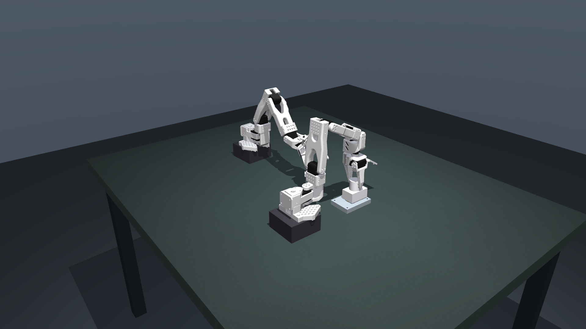
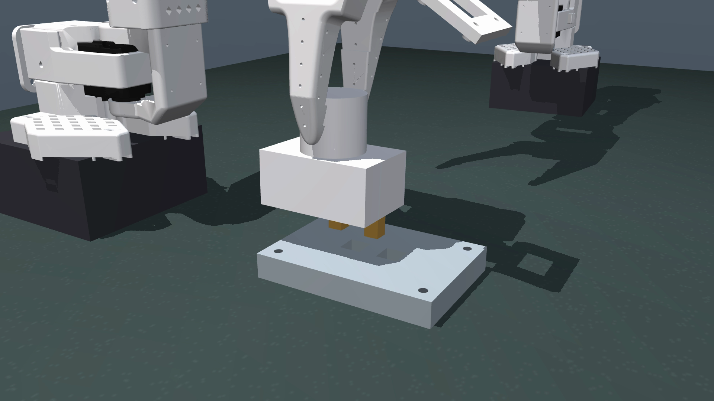

# Restored original plug — videos and checks

Four identical housings hide different two-prong offsets. All four insert in
native MuJoCo and MjLab/Warp CPU. These are **privileged scripted controls**, not
trained visual policies; the camera follows a blind schedule. No training ran.



| Hidden offset | Both arms, 1080p | Task close-up, 1080p | Actual Warp state, 1080p close-up | Native policy views |
|---|---|---|---|---|
| `xm`: x −15 mm | [Video](native/plug_xm_clean_overview.mp4) | [Video](native/plug_xm_clean_detail.mp4) | [Video](warp/plug_xm_warp_detail.mp4) | [Video](native/plug_xm_clean.mp4) |
| `xp`: x +15 mm | [Video](native/plug_xp_clean_overview.mp4) | [Video](native/plug_xp_clean_detail.mp4) | [Video](warp/plug_xp_warp_detail.mp4) | [Video](native/plug_xp_clean.mp4) |
| `ym`: y −15 mm | [Video](native/plug_ym_clean_overview.mp4) | [Video](native/plug_ym_clean_detail.mp4) | [Video](warp/plug_ym_warp_detail.mp4) | [Video](native/plug_ym_clean.mp4) |
| `yp`: y +15 mm | [Video](native/plug_yp_clean_overview.mp4) | [Video](native/plug_yp_clean_detail.mp4) | [Video](warp/plug_yp_warp_detail.mp4) | [Video](native/plug_yp_clean.mp4) |

[Actual Warp RGB: wrist and camera-arm images, all four worlds together](warp/plug_all_variants_warp.mp4).
HD videos use native OpenGL; Warp close-ups mirror the actual Warp simulation
state and the matching variant geometry. Policy videos use 128×96 source images,
enlarged for viewing. All observer cameras are excluded from policy observations.



The [matched-view gallery](visibility/matched_reset_views.png) compares all four
variants at the same reset state: wrist, camera-home, and a low fixed view. The
wrist has a small `xp` clue, and the low fixed view sees all four. This gallery
does not establish task success or select a trained fixed-camera baseline.

- [Restoration specification, retained study settings and interpretation](../../docs/PLUG_RESTORATION.md)
- [Warp success, position errors and matched RGB comparisons](warp/warp_report.json)
- [Twelve randomized native scripted checks: 12/12 successful](randomized_native.json)
- [Per-camera segmentation and pixel comparisons across 26 fixed views](visibility/matched_views.json)
- [Video dimensions, frame counts and decode checks](video_validation.json)
- [Full regression test output](../tests.log)

Reproduce all videos and visibility checks without training:

```bash
uv run python -m active_perception_arms.plug_audit
```

The videos in the older `artifacts/sanity` and `artifacts/warp_sanity` directories
are historical centered-pin results. They are retained rather than relabeled as
the restored hidden-prong task.
