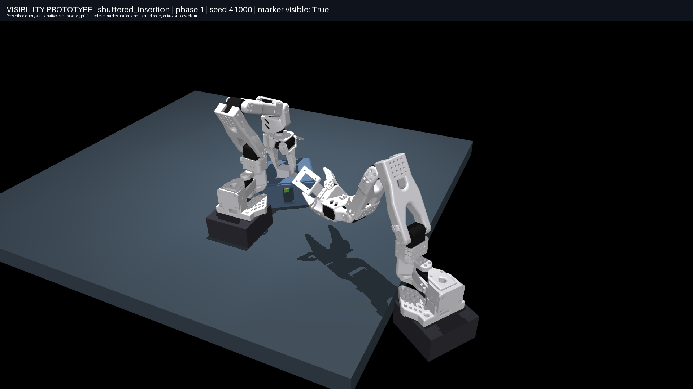

# Pre-training task screen

**[Watch the three shortlisted prototype videos](diagnostics/shortlist/README.md)**
for freshly recorded, synchronized outside and sensor views with the camera-stow
sequence applied to every scene.

Read the [shortlist, methods, results and limitations](../../docs/TASK_SCREENING.md).
These are **visibility prototypes with prescribed query states**, not successful
manipulation policies. Camera destinations use privileged information. Camera
motion in the videos executes native MuJoCo servo dynamics; the hand/feature phase
changes are prescribed. No training was performed.

**Scope correction, October 5:** these clips use the new centered-pin/marker
geometry, not the original project's plug with hidden ±15 mm prong offsets.
Their hand-retreat results do not assess that original task. See the correction
at the start of the [study report](../../docs/TASK_SCREENING.md).

The first two rows are the leading candidates for further mechanical development.
The third is an intentional negative control. Outside videos are 1920×1080 at
25 fps; sensor mosaics enlarge the actual 96×72 images without adding detail.

| Prototype | Outside video | Wrist / searched fixed / moving camera | Still |
|---|---|---|---|
| Changing side access during insertion | [Watch](diagnostics/shuttered_insertion_overview.mp4) | [Sensors](diagnostics/shuttered_insertion_sensors.mp4) | [View](diagnostics/shuttered_insertion_phase1.png) |
| Two-site seating, camera stowed before hand relocation | [Watch](diagnostics/stowed_two_site/two_site_seating_overview.mp4) | [Sensors](diagnostics/stowed_two_site/two_site_seating_sensors.mp4) | [View](diagnostics/stowed_two_site/two_site_seating_phase2.png) |
| Open-slot pushing | [Watch](diagnostics/open_slot_push_overview.mp4) | [Sensors](diagnostics/open_slot_push_sensors.mp4) | [View](diagnostics/open_slot_push_phase1.png) |
| Open reference | [Watch](diagnostics/open_reference_overview.mp4) | [Sensors](diagnostics/open_reference_sensors.mp4) | [View](diagnostics/open_reference_phase1.png) |
| Static recess, persistent state | [Watch](diagnostics/static_recess_overview.mp4) | [Sensors](diagnostics/static_recess_sensors.mp4) | [View](diagnostics/static_recess_phase1.png) |
| Static aperture, fresh offset | [Watch](diagnostics/recess_with_slip_overview.mp4) | [Sensors](diagnostics/recess_with_slip_sensors.mp4) | [View](diagnostics/recess_with_slip_phase1.png) |

## Evidence and retained failures

- [96×72 screen](pixel_screen/screening.json): 24 validation and 48 test seeds;
  522 searched fixed poses per candidate, including validation-only local refinement;
  32 sampled active endpoints. Both query states must meet the visibility criterion.
- [192×144 sensitivity](resolution_192/screening.json): same seeds, matched image
  sizes across camera conditions, separate validation selection at the new size.
- [Path, scan, phase schedule, retreat and waiting checks](diagnostics/diagnostics.json).
  These path rates check instantaneous queries without persistent-state memory;
  use the main screen for memory comparisons.
- [Pixel counterfactuals and original native servo checks](diagnostics/rendered_checks.json).
  Every original demonstration uses the first test seed, 41000; it was not chosen
  for a favorable visibility gap. The counterfactual shows query phase 1 with a
  marker-only 6 mm displacement. For example, the selected fixed view *does* see
  that particular changing-access phase; the aggregate result concerns both phases
  over different episodes, not a claim that fixed sensing never works.
- [Changing-access counterfactual](diagnostics/shuttered_insertion_counterfactual.png),
  [two-site counterfactual](diagnostics/two_site_seating_counterfactual.png), and
  [pushing counterfactual](diagnostics/open_slot_push_counterfactual.png).
- [Original unstowed two-site video](diagnostics/two_site_seating_overview.mp4):
  **failure retained**. Five frames have camera/environment or camera/hand contact
  deeper than 1 mm, and the last query is not observed. The prescribed hand-phase
  transition invalidated the previous camera placement.
- [Corrected two-site servo report](diagnostics/stowed_two_site/rendered_checks.json):
  stow before relocating the hand; zero camera collision frames; each phase has
  visible frames. This is a one-seed camera-motion check, not full-task validation.
- [Video format checks](diagnostics/video_validation.json) and [test results](../tests.log).

Development probes used smaller samples, an earlier ray-bin approximation, and an
earlier pushing mockup with geometric overlap. They remain locally in ignored
development/archive directories. They are not the results linked above. The final
screen uses pixel-center rays, a real pushing tip/block, and reports no fixture
penetrations deeper than 1 mm in any sampled query snapshot.

The current prototypes all permit a revealing hand retreat. Consequently none is
claimed to prove an unavoidable need for an active camera. Proposed loaded
connector/clip variants require the additional mechanical and action-necessity
checks specified in the study report.
